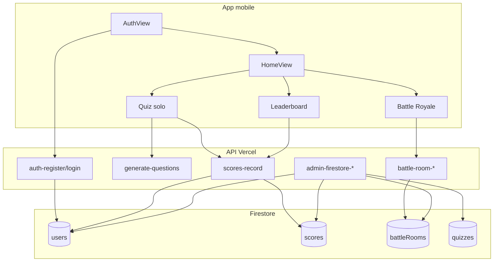

# Données Firestore — référence complète QuizBit

Ce document décrit **comment les données sont structurées**, **comment elles circulent** entre l'app mobile, l'API Vercel, Firebase Firestore et les panels admin, et **comment chaque collection est normalisée** avant affichage ou utilisation.

## 1. Vue d'ensemble

```txt
App mobile (React Native)
  POST /api/*  +  idToken Firebase
        │
        ▼
API Vercel (vercel/api/index.js → vercel/lib/api/*)
  verifyIdToken() · assertAccountId() · firebase-rest.js
        │
        ▼
Firestore (REST API Firebase)
  collections : users · scores · battleRooms · quizzes
        │
        ▼
Panels admin
  Vercel : SDK client OU routes admin-firestore-* (REST + normalisation)
  Local  : miroir JSON dans local/data/store.json (mode offline, pas Firestore)
```

**Règle produit** : l'application mobile de production ne fabrique pas de fausses données. Comptes, scores et battles passent par Firebase Auth + API Vercel + Firestore.

**Exception** : le mode **offline** de l'app pointe vers `local/` (`store.json`) avec la même forme de données, mais sans connexion Firestore.

## 2. Couche de normalisation

Fichier central : `vercel/lib/firestore-normalize.js`

| Rôle | Détail |
|------|--------|
| `normalizeRow(collection, doc)` | Point d'entrée unique selon la collection |
| `normalizeQuiz` | Thème, questions QCM/open, alias de champs |
| `normalizeUser` | `displayName` depuis plusieurs alias |
| `normalizeScore` | Score numérique, mode `solo` / `battle_royale` |
| `normalizeBattleRoom` | Code, config, tableau `players` |
| `COLLECTION_ALIASES` | Noms alternatifs lus en fallback |
| `ORDER_BY` | Ordres de tri tentés si l'index Firestore manque |

### Alias de collections lus en fallback

| Clé logique | Noms Firestore essayés |
|-------------|------------------------|
| `quizzes` | `quizzes`, `quiz`, `Quiz` |
| `users` | `users`, `user`, `players` |
| `scores` | `scores`, `score` |
| `battleRooms` | `battleRooms`, `battle_rooms`, `battles` |

### Normalisation des questions (quiz)

Entrée brute (IA, import JSON, panel) → sortie uniforme :

```ts
type Question = {
  id: string;
  text: string;
  answer: string;
  type: 'mcq' | 'open';
  options?: string[];      // mcq uniquement, 2 à 5 choix
  exactAnswer?: boolean;   // QRO mode « nom exact »
};
```

Règles (`normalizeQuestions`) :
- `text` ← `text`, `question`, `label`
- `answer` ← `answer`, `correctAnswer`
- Si `type === 'open'` ou moins de 2 options → question ouverte
- Sinon → QCM avec `options` nettoyées

## 3. Collection `users`

**ID document** : UID Firebase Auth (`localId`).

### Schéma

```ts
{
  id: string;              // = UID Firebase (clé document)
  email: string;
  displayName: string;
  avatarUrl?: string;
  gamesPlayed: number;
  totalScore: number;
  bestScore: number;
  createdAt?: string;      // ISO 8601
  updatedAt?: string;
}
```

### Création

| Étape | Fichier / route |
|-------|-----------------|
| Inscription Firebase Auth | `vercel/lib/api/auth-register.js` |
| Création profil Firestore | `setDocument('users', uid, account, idToken)` |
| Session mobile | `AuthController` → AsyncStorage |

### Lecture

- App : profil renvoyé par `/api/auth-login` et `/api/auth-register`
- Panel Vercel : page **Users** → `admin-firestore-list` ou SDK `collection(db, 'users')`

### Mise à jour

| Action | Route | Champs modifiés |
|--------|-------|-----------------|
| Avatar | `/api/user-update-avatar` | `avatarUrl` |
| Stats après partie | `/api/user-update-stats` | `gamesPlayed`, `totalScore`, `bestScore`, `updatedAt` |

### Présentation panel Vercel

- Colonnes tableau : email, displayName, gamesPlayed, totalScore, bestScore
- Détail JSON : document complet normalisé
- CRUD : créer / modifier / supprimer via modale JSON (`admin-firestore-upsert` / `admin-firestore-delete`)

Champs **jamais** persistés via CRUD admin : `password`, `idToken` (sanitisés dans `admin-firestore-mutate.js`).

## 4. Collection `scores`

**ID document** : auto-généré par Firestore (`addDocument`).

### Schéma

```ts
{
  id?: string;             // ID Firestore (ajouté à la lecture)
  userId: string;          // UID du joueur
  displayName: string;
  theme: string;           // thème du quiz (max 120 car.)
  score: number;           // clampé côté serveur
  mode: 'solo' | 'battle_royale';
  createdAt: string;       // ISO 8601
}
```

### Écriture

Route : `/api/scores-record` (`vercel/lib/api/scores-record.js`)

1. Vérifie `idToken` et correspondance `account.id` ↔ `auth.uid`
2. Lit le profil `users/{uid}` pour le `displayName`
3. Crée une entrée dans `scores`
4. L'app appelle ensuite `/api/user-update-stats` pour agréger sur le profil

**Battle Royale** : à la fin d'une partie, l'app enregistre le score avec `mode: 'battle_royale'` **avant** `battle-room-finish`.

### Lecture / classement

Route : `/api/scores-list`

- Tri : `score desc` (fallback sans index)
- Filtre optionnel par `mode`
- Top 50 renvoyé à l'app (`LeaderboardView`)

Normalisation : `mode` forcé à `battle_royale` ou `solo` ; `score` numérique.

### Présentation panel Vercel

- Page **Scores** : historique + analytics (solo vs battle)
- Filtres recherche côté client sur les lignes chargées
- Export CSV / JSON

## 5. Collection `battleRooms`

**ID document** : **code de salle** (6 caractères alphanumériques majuscules, ex. `A1B2C3`).

### Schéma complet

```ts
{
  id: string;              // ex. room-1712345678901
  code: string;            // = ID document Firestore
  hostId: string;          // UID créateur
  status: 'waiting' | 'active' | 'finished';
  config: {
    mode: 'classic' | 'timed_mcq';
    theme: string;
    maxPlayers: number;    // 2–100
    questionCount: number; // 3–20
    eliminationScore: number;
    timeLimitSeconds: number; // timed_mcq, 5–120 s
  };
  players: Array<{
    userId: string;
    displayName: string;
    score: number;
    eliminated: boolean;
    finished: boolean;
  }>;
  questions?: Question[];  // rempli au démarrage (status → active)
  chatMessages?: Array<{
    id: string;
    userId: string;
    displayName: string;
    text: string;
    createdAt: string;
  }>;
  winnerId?: string;
  createdAt: string;
}
```

### Cycle de vie et routes API

| Statut | Actions | Route |
|--------|---------|-------|
| — | Créer lobby | `POST /api/battle-room-create` |
| `waiting` | Rejoindre | `POST /api/battle-room-join` |
| `waiting` | Lister lobbies actifs | `POST /api/battle-room-list` |
| `waiting` | Chat lobby | `POST /api/battle-room-chat` |
| `waiting` | Lire salle | `POST /api/battle-room-get` |
| `waiting` → `active` | Démarrer (hôte) | `POST /api/battle-room-start` |
| `active` | Fin joueur | `POST /api/battle-room-finish` |
| * | Supprimer lobby | `POST /api/battle-room-delete` |

### Règles métier importantes

- **Rejoindre** : uniquement si `status === 'waiting'` et places disponibles
- **Démarrer** : seul `hostId` ; injecte `questions` ; vide `chatMessages`
- **Finish** : met à jour le joueur (`score`, `finished`, `eliminated` si score < `eliminationScore`)
- **Finished** : quand tous les joueurs ont `finished: true` → `status: 'finished'`, `winnerId` = meilleur survivant

### Liste des lobbies actifs (`battle-room-list`)

Retourne un résumé léger (`BattleLobbySummary`) :

```ts
{
  code: string;
  theme: string;
  status: 'waiting' | 'active';
  mode: 'classic' | 'timed_mcq';
  playerCount: number;
  maxPlayers: number;
  hostName: string;
  createdAt: string | null;
}
```

Filtre : `waiting` ou `active` uniquement (pas `finished`). Tri : `createdAt` décroissant.

### UI mobile Battle Royale

`BattleRoyaleView.tsx` — deux onglets :

1. **Créer un lobby** : formulaire classique (thème, mode, paramètres)
2. **Rejoindre** : code manuel + liste des lobbies actifs (refresh 5 s)

Les lobbies **en cours** sont affichés mais non rejoignables.

### Présentation panel Vercel

- Page **Battle Rooms** : code, statut, thème, joueurs, config
- Analytics dashboard : `activeRooms`, `waitingRooms`, `finishedRooms`

## 6. Collection `quizzes`

Collection **optionnelle** — stocke les quiz générés ou importés pour consultation admin.

### Schéma

```ts
{
  id?: string;
  theme: string;
  questions: Question[];
  format?: 'quizbit-quiz-v1';
  source?: string;         // ex. admin-panel, ollama, gemini
  provider?: string;
  model?: string;
  createdAt?: string;
  updatedAt?: string;
}
```

### Écriture

- Panel Vercel : `admin-save-quiz` ou CRUD `admin-firestore-upsert`
- Génération IA : résultat peut être exporté JSON sans écriture Firestore obligatoire

### Lecture

- Panel **Quiz & Questions** : normalisation via `normalizeQuiz`
- Export offline : format `quizbit-quiz-v1` → import panel local

## 7. Accès Firestore depuis le panel Vercel

Deux modes coexistent :

### Mode A — SDK client (navigateur)

Si les variables `VITE_FIREBASE_*` sont configurées et que l'utilisateur est connecté côté client, le panel lit directement via `firebase/firestore`.

### Mode B — API serveur (recommandé en production)

Routes protégées par `ADMIN_PANEL_KEY` / `VITE_ADMIN_PANEL_KEY` :

| Route | Rôle |
|-------|------|
| `admin-firestore-stats` | Compteurs par collection |
| `admin-firestore-list` | Liste paginée + `normalizeRow` |
| `admin-firestore-upsert` | Création / mise à jour |
| `admin-firestore-delete` | Suppression |

**Token Firestore** (`panel-firestore.js`) :
1. `idToken` fourni par l'UI (connexion manuelle Paramètres → Connecter Firestore)
2. Sinon compte service `PANEL_FIRESTORE_EMAIL` + `PANEL_FIRESTORE_PASSWORD` sur Vercel

Si l'accès échoue : réponse `firestoreReady: false` avec message guidant vers Paramètres.

## 8. CRUD admin (Vercel et local)

### Panel Vercel

Fichiers : `vercel/src/adminCrud.js`, modale JSON dans `App.jsx`

| Page panel | Collection Firestore | Opérations |
|------------|---------------------|------------|
| Quiz & Questions | `quizzes` | Créer, Modifier, Supprimer |
| Users | `users` | Créer, Modifier, Supprimer |
| Scores | `scores` | Créer, Modifier, Supprimer |
| Battle Rooms | `battleRooms` | Créer, Modifier, Supprimer |

Mutations serveur : `vercel/lib/admin-firestore-mutate.js` (sanitisation, alias, `updatedAt`).

### Panel local

Fichier : `local/lib/admin-crud.js` + `local/app.js`

Même logique CRUD mais sur `localStorage` / sync vers `store.json` via l'API offline. **Ne modifie pas Firestore.**

## 9. Miroir offline (`local/data/store.json`)

Structure alignée sur Firestore pour compatibilité API mobile :

```ts
{
  users: User[];           // inclut mot de passe hash en clair (demo local)
  quizzes: Quiz[];
  scores: Score[];
  battleRooms: Record<string, BattleRoom>;  // clé = code
  sessions: Record<string, Session>;
}
```

| Aspect | Firestore cloud | Store local |
|--------|-----------------|-------------|
| Persistance | Firebase | Fichier JSON |
| Auth | Firebase Auth | Comptes locaux + sessions |
| Battle list | `battle-room-list` REST | `battleRoomsList()` dans `offline-api.js` |
| Génération quiz | Gemini / Mistral | Ollama (`smollm2:135m`) puis banque locale |

Compte démo : `demo@local.quizbit` / `demo123`.

## 10. Diagramme des flux principaux



## 11. Sécurité et bonnes pratiques

- Toutes les routes d'écriture mobile exigent un `idToken` Firebase valide
- `assertAccountId` / `assertUserId` empêchent d'écrire au nom d'un autre utilisateur
- Clés Gemini, Mistral, Cloudinary : **uniquement** côté serveur Vercel
- Panel admin : clé `ADMIN_PANEL_KEY` pour les routes sensibles
- Ne pas committer `.env`, mots de passe panel, ni `local/data/store.json` (dans `.gitignore`)

## 12. Dépannage données

| Symptôme | Cause probable | Action |
|----------|----------------|--------|
| Panel 401 Firestore | Token panel absent / expiré | Paramètres → Connecter Firestore ou vars Vercel |
| Collection vide | Mauvais nom ou règles Firestore | Vérifier alias dans `COLLECTION_ALIASES` |
| Score battle absent du Top | `mode` pas `battle_royale` | Vérifier `recordScore` avant `finishPlayer` |
| Lobby invisible | Statut `finished` | Normal : seuls `waiting`/`active` dans la liste |
| Questions mal typées | JSON IA non standard | Passer par `normalizeQuestions` |
